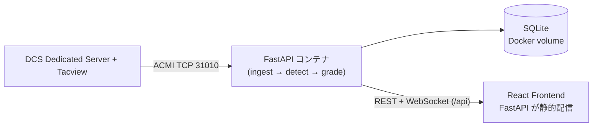

# DCS Landing Teacher

[](https://github.com/MasterMk2/DCSLandingTeacher/actions/workflows/ci.yml)
[](LICENSE)

DCS World Dedicated Server 上で行われた着陸（陸上空港）／着艦（空母）を、
Tacview の ACMI データストリームから記録・評価し、ブラウザで振り返りできるようにするツールです。

- Tacview Realtime Telemetry（ACMI 2.2 Text / TCP 31010）の受信・解析
- **ACMI ファイルインポート**: 過去の Tacview 記録（.acmi / .acmi.txt / .acmi.zip）から着陸記録を一括生成
- 着陸／着艦イベントの自動検出（タッチダウン・ボルター・タッチアンドゴーの識別）
- 米海軍式 LSO グレーディングによる空母着艦の自動評価（OK / OK- / (OK) / _NO_GRADE_ / CUT ＋ファクター）
- 陸上着陸の簡易評価（グライドスロープ偏差・センターライン偏差・接地降下率・速度 → A〜E 評点）
- Web UI での閲覧
  - 着陸履歴ダッシュボード（プレイヤー / 機体 / 場所 / グレード等でフィルタ）
  - **GCA（PAR）スコープ風ビュー**: 最終進入の方位角・仰角軌跡をレーダースコープ風に描画
  - トップダウン軌跡ビュー、時系列チャート（偏差・速度・AOA・降下率）
  - 着陸検出のリアルタイム通知（WebSocket）
  - CSV エクスポート

詳細な要件は [`plans/requirements.md`](plans/requirements.md)、実装構成は [`docs/architecture.md`](docs/architecture.md) を参照してください。

## スクリーンショット

<!-- TODO: 公開前に実際のスクリーンショットを差し替えてください -->

| ダッシュボード | GCA スコープ | 時系列チャート |
|:---:|:---:|:---:|
|  |  |  |

## システム構成（概要）



本番（Docker）では **フロントエンドをビルドして FastAPI が静的配信する 1 コンテナ構成**が既定です。
開発時は Vite dev server（プロキシ付き）とバックエンドを分けて起動します。

## セットアップ

### パターン A: Docker Compose（推奨）

必要なもの: Docker Desktop（Windows / macOS）または Docker Engine + Compose v2（Linux）。

```bash
cp .env.example .env        # Tacview のホスト/ポート等を必要に応じて編集
docker compose up --build
```

- ブラウザで `http://localhost:8000` を開くと Web UI が表示されます
- SQLite データは名前付きボリューム `dlt-data`（コンテナ内 `/data`）に永続化されます
- `config/grading.yaml` は読み取り専用マウントされるため、評価閾値を編集して
  再評価 API を叩けば即座に反映されます
- Linux では `host.docker.internal` が `extra_hosts` 設定によりホスト OS を指します
  （DCS + Tacview が同一ホストで動いている場合の既定値）

### パターン B: Windows（ネイティブ）

必要なもの: Python 3.11 以上、Node.js 20 以上（フロントエンドをビルドする場合）。

```powershell
# バックエンド
cd backend
python -m venv .venv
.venv\Scripts\Activate.ps1
pip install -e ".[dev]"
copy ..\.env.example ..\.env   # 必要に応じて編集
uvicorn app.api.main:create_app --factory --port 8000
```

```powershell
# フロントエンド（別ターミナル。開発時は Vite dev server を利用）
cd frontend
npm ci
npm run dev     # http://localhost:5173 （/api をバックエンドへプロキシ）
```

本番相当でバックエンドに静的配信させる場合は、先に `npm run build` してから
リポジトリルートで `uvicorn` を起動してください（`frontend/dist` が存在すれば自動で配信します）。

### パターン C: Linux（ネイティブ）

```bash
# バックエンド
cd backend
python3 -m venv .venv
source .venv/bin/activate
pip install -e ".[dev]"
cp ../.env.example ../.env   # 必要に応じて編集
uvicorn app.api.main:create_app --factory --port 8000

# フロントエンド（別ターミナル）
cd frontend && npm ci && npm run dev
```

動作確認: `http://localhost:8000/api/health` にアクセスして `"status": "ok"` が返ることを確認してください。

## Tacview 側の設定

1. DCS World に Tacview アドオンを導入する
2. Tacview の設定（`Tacview.ini` または DCS 内メニュー）で
   **Realtime Telemetry 出力を有効化**する
   - 既定では `ACMI 2.2 Text` 形式で **TCP ポート 31010** をリッスンします
   - パスワードを設定した場合は `.env` の `DLT_TACVIEW_PASSWORD` にも同じ値を設定してください
3. 本ツール側の `.env` で接続先を合わせる

| 変数 | 既定値 | 説明 |
|---|---|---|
| `DLT_TACVIEW_HOST` | `127.0.0.1` | Tacview Realtime Telemetry のホスト |
| `DLT_TACVIEW_PORT` | `31010` | 同ポート |
| `DLT_TACVIEW_CLIENT_NAME` | `DCSLandingTeacher` | ハンドシェイクで通告するクライアント名 |
| `DLT_TACVIEW_PASSWORD` | （空） | Telemetry 保護時のパスワード |
| `DLT_ACMI_ENABLED` | `true` | `false` で ACMI 受信を停止（API 単体運用向け） |
| `DLT_MIGRATIONS_ON_STARTUP` | `true` | 起動時に Alembic マイグレーションを自動適用。`false` で従来の create_all に戻す（開発用） |
| `DLT_AUTH_TOKEN` | （空） | 簡易トークン認証の共有トークン。空なら認証なし（既定）。詳細は「簡易トークン認証」の節を参照 |
| `DLT_IMPORT_MAX_UPLOAD_MB` | `200` | ACMI ファイルインポートのアップロードサイズ上限（MB）。詳細は「ACMI ファイルのインポート」の節を参照 |

### データベースマイグレーション

スキーマ管理には Alembic を使用しています（Issue #7）。アプリ起動時に未適用の
マイグレーションが自動で適用され、空の DB からは全スキーマが作成されます。
旧バージョン（create_all 時代）で作成した DB も自動検出してベースラインに
スタンプし、以降のマイグレーションが適用されるため、そのまま起動するだけで移行できます。

手動操作は `backend/` ディレクトリで:

```bash
alembic current          # 現在のリビジョン表示
alembic upgrade head     # 未適用マイグレーションの適用
```

詳細な環境変数一覧は [`.env.example`](.env.example) を参照してください。
接続は自動再接続（指数バックオフ）に対応しています。

## API 概要

すべての REST エンドポイントは `/api` プレフィックスを持ちます
（OpenAPI スキーマ: `http://localhost:8000/docs`）。

### 簡易トークン認証（Issue #8）

`.env` の `DLT_AUTH_TOKEN` にトークンを設定すると、Web UI / API へのアクセスに
共有トークン認証がかかります（**既定は空＝認証なし**で、従来どおり動作します）。

- `/api` 配下の REST エンドポイントは `Authorization: Bearer <token>` または
  `X-Auth-Token` ヘッダを要求します（未提示は 401、誤りは 403）
- WebSocket（`/api/ws/landings`）はブラウザからヘッダを付けられないため
  `?token=<token>` クエリパラメータで認証します。不正トークンは接続拒否
- `/api/health`（死活監視用）と SPA 静的配信は認証対象外です
- トークン比較は定数時間比較（`secrets.compare_digest`）を使用しています
- Web UI は 401/403 を検出するとトークン入力モーダルを表示し、入力した
  トークンを localStorage に保存します。ナビバーの「認証設定」ボタンで
  消去・再入力できます

| メソッド | パス | 説明 |
|---|---|---|
| GET | `/api/health` | 死活監視・ACMI 接続状態 |
| GET | `/api/landings` | 着陸履歴一覧（`player` / `airframe` / `venue` / `kind` / `grade` / `outcome` / `date_from` / `date_to` / `limit` / `offset` でフィルタ・ページング） |
| GET | `/api/landings/{id}` | 個別着陸の詳細（グレード、ファクター、進入軌跡サンプル、接地状態） |
| POST | `/api/landings/{id}/regrade` | 保存済み進入データに対し現在の閾値で再評価 |
| POST | `/api/import` | ACMI ファイルのインポート（multipart、バックグラウンド処理。ジョブ ID を即時返却） |
| GET | `/api/imports` | インポートジョブの一覧（新しい順） |
| GET | `/api/imports/{id}` | インポートジョブの進捗・結果サマリ |
| **WebSocket** | `/api/ws/landings` | 着陸検出のリアルタイム通知＋インポート完了通知（`ping` 送信で `pong` 応答） |

## ACMI ファイルのインポート（過去の Tacview 記録から着陸記録を生成）

リアルタイム受信を設定していない過去のフライトも、Tacview のローカル記録から
着陸記録を生成できます。

### ユースケース: Tacview のローカル記録フォルダから投入する

1. Tacview はフライトごとに記録を保存しています（既定では
   `%USERPROFILE%\Documents\Tacview\` 以下。DCS 専用フォルダを設定している場合はその配下）。
   拡張子は `.acmi`（zip 圧縮されている場合あり）または `.acmi.zip` です
2. Web UI のダッシュボードで「**ACMI ファイルをインポート**」ボタンを押し、
   ファイルをドラッグ＆ドロップ（またはクリックして選択）します
3. アップロード → 解析はバックグラウンドで実行され、プログレス表示が
   「待機中 → 解析中 → 完了」と遷移します
4. 完了すると「検出 N 件・重複スキップ M 件」のサマリが表示され、
   検出された着陸はリアルタイム受信と同じく一覧・詳細ビューに反映されます
   （WebSocket 通知も共通です）

大量のファイルをまとめて処理する場合は API を直接呼び出せます:

```bash
curl -X POST -H "X-Auth-Token: <token>" \
     -F "file=@20240101_多発.acmi" http://localhost:8000/api/import
# => {"id":"<job_id>", ...}
curl -H "X-Auth-Token: <token>" http://localhost:8000/api/imports/<job_id>
```

### 重複防止

同じファイルを何度インポートしても着陸レコードが二重登録されないよう、
各タッチダウンについて **ACMI ヘッダの `ReferenceTime` ＋ タッチダウン時刻 ＋
機体オブジェクト ID** の組み合わせで既存レコードをチェックし、一致したものは
スキップしてサマリに報告します。

### 制限

- 受付拡張子は `.acmi` / `.acmi.txt` / `.acmi.zip`（中身が zip 圧縮された
  `.acmi` も自動判別して展開します）
- アップロードサイズ上限は既定 200MB（環境変数 `DLT_IMPORT_MAX_UPLOAD_MB` で変更可）。
  超過したアップロードは HTTP 413 で拒否されます
- インポートジョブの一覧はメモリ上に保持されるため、サーバー再起動で消えます
  （確定した着陸レコード自体は DB に残ります）
- 7z コンテナ（`.acmi.7z`）は未対応です。zip に変換してご利用ください

> WebSocket のパスは **`/api/ws/landings`** に統一されています（ルーター共通の `/api`
> プレフィックス付き）。フロントエンドもこのパスを使用しています。

## 評価方式

### 空母着艦: LSO グレード

米海軍式の LSO グレーディングに基づき、FLOLS 想定のグライドスロープ（3.5°、ランプ基準）と
センターラインからの偏差から **OK / OK- / (OK) / _NO_GRADE_ / CUT** を自動付与します。
加えて ARCON / AOC / AOS / FAST / SLOW / HIGH / LOW / OFFLINE / BOLTER 等の
ファクターを検出し、根拠データとともに記録します。

### 陸上着陸: 簡易評点

グライドスロープ偏差（3°想定）・センターライン保持・接地降下率（fpm）・接地速度
（ファイナル終盤の保持速度に対する比）をそれぞれ 0〜100 点で採点し、重み付け合成で
**A〜E** を付与します。オーバーヘッドパターンを実際に飛んでいた場合（軌跡から
ダウンウィンド脚が取れた場合）は、パターン自体も採点対象に加わります。

**測れなかった項目は採点しません。** 記録が短くてグライドスロープを測れない、
ヘリコプターなので接地速度比に意味が無い、といった項目は素点を持たず（API では
`score: null`）、重みごと合成から外れます。中立点を置くと「測ったうえで並」と
読まれてしまうためで、詳細画面には未評価の項目とその理由が表示されます。
採点できた重みが `min_measured_weight` に届かない着陸（進入がほとんど記録されて
いないもの）には成績を付けず、`grade` / `score` は `null` になります。

### 滑走路ジオメトリと対応マップ

陸上着陸は、DCSServerBot の RestAPI 経由で **DCS 自身から取った実際の滑走路**
（しきい値の位置・コース・長さ）を基準に採点します。`DLT_DCSSB_BASE_URL` が空の
場合は接地点から推定したジオメトリにフォールバックします（精度は落ちますが外部
サービス不要）。

**マップごとの設定は不要です。** Caucasus / Nevada（Nellis）/ Syria / Mariana
Islands など、どのマップでも同じ経路で動きます。

- ACMI にマップ名は入りません（DCS は `Theater` を書き出しません）。そのため
  着陸座標から「稼働中のどのサーバの theatre か」を判定し、そのマップだけを
  1 回スイープして `cache/runways-<Theatre>.json` に保存します。判定に使う
  `/servers` と `/airbases` は bot 内部の状態から返るため、DCS のシミュレーション
  スレッドを消費しません。
- したがって **そのマップを載せた DCS サーバが 1 台でも起動していること** が
  スイープの条件です。過去の録画を import する場合も同じで、そのマップが今どこかで
  動いていれば掃引され、動いていなければ推定ジオメトリになります。一度掃引すれば
  以降はキャッシュだけで解決するので、サーバがマップを切り替えても過去の記録は
  正しい滑走路に当たり続けます。
- `DLT_DCSSB_SERVER_NAME` を指定した場合、そのサーバが **今実際に動かしている**
  theatre だけが掃引対象になります（別マップを動かしている間は掃引しません）。
- 平行滑走路（Nellis の 03L/21R・03R/21L など）は左右の区別を保ったまま扱われ、
  接地点はしきい値までの距離ではなく延長センターラインからの横ずれで判定されます。
- 解決できた滑走路は着陸行の「空港 / 空母」欄に `Nellis 03L` の形で入ります。
  推定ジオメトリで採点された着陸は空欄のままです（どこに降りたか分からないため）。

#### マップを1回だけ「押さえる」

滑走路ジオメトリは **そのマップがロードされている間しか取れません**。terrain 側の
`terrain.cfg.lua.pak.crypt` は暗号化されており、DCSServerBot の `/airbase` は
ロード中のミッションに対して Lua を実行するためです。つまり誰も飛んでいないマップは
その場では取得できず、**一度捕まえて同梱しておく**のが唯一の方法になります。

そのための操作口があります（`DLT_AUTH_TOKEN` 設定時はトークンが必要）。

```bash
# 1) いま何が解決でき、いま何を捕まえられるか
curl -s localhost:8000/api/v1/runways | jq
# => {"theatres":[{"theatre":"Caucasus","runways":42,"airbases":21,"origin":"shipped"}],
#     "running":["Nevada"], "can_sweep":true}

# 2) 動いているうちに捕まえる（空港1つあたり約1.5秒。着陸が発生するのを待つ必要はない）
curl -s -X POST 'localhost:8000/api/v1/runways/sweep?theatre=Nevada' | jq

# 3) リポジトリに焼く → 以後どのビルドでも DCS サーバ無しで解決できる
curl -s localhost:8000/api/v1/runways/Nevada > config/runways/runways-Nevada.json
```

`config/runways/` に置いた JSON はイメージビルド時にパッケージ内部
（`app/runways/defaults/`）へ複製され、`/app/config` への空バインドマウントに
潰されません（tuning YAML と同じ理屈・同じ経路）。読み込み順は
**書き込み可能キャッシュ → 同梱シード**で、そのサーバで掃引した結果が常に優先されます。

#### ゲーム内フックで捕獲する（正確・推奨）

同梱シードは DCSServerBot 経由ではなく、ゲーム内フックで取っています。

1. [`scripts/dlt-capture-runways.lua`](scripts/dlt-capture-runways.lua) を
   `<Saved Games>/<DCS>/Scripts/Hooks/` に置いてミッションをロードする
2. ロード完了時に `Logs/dlt-runways.json` へ全空港の滑走路が書き出される
3. `python scripts/dlt_runways_from_dump.py dlt-runways.json` で
   `config/runways/runways-<Theatre>.json` ができる（`"exact": true`）

違いは座標変換です。DCS の x/z は横メルカトルの格子なので、外で緯度経度に直すには
子午線収差だけでなく**縮尺係数**も要ります。DCSServerBot の `/airbase` は格子座標しか
返さないためこの変換が近似になり、Caucasus で中央子午線（東経33°）から離れた東部の
空港ほどしきい値が最大 18 m ずれることを実測しました。フックは DCS 自身の
`coord.LOtoLL` で変換するので近似がありません。そのため `exact` なシードは
そのサーバでのライブ掃引より**優先**されます。

同梱済みのマップ: Caucasus / Nevada / MarianaIslands / PersianGulf / SinaiMap / Syria。

DCS の `getRunways()` が返す滑走路名はそのまま信用していません。平行滑走路の L/R が無い
（Nellis は `3` と `21` の2本）、別の滑走路に名前が付いている（Sinai の Ben-Gurion は
08/26 が `21`、12/30 が `8`）といった例が実データにあるため、方位と合わない名前は捨てて
方位から付け直し、平行滑走路には位置関係から L/C/R を付けます。

DCSServerBot が無い環境でも、この形式の JSON を置けば動きます。

```jsonc
// config/runways/runways-Nevada.json（cache/ に置いたものと同一形式）
{
  "version": 2,          // CACHE_VERSION。古い版は無視され再掃引されます
  "theatre": "Nevada",
  "runways": [
    {
      "airbase": "Nellis",
      "name": "03L",
      "threshold_lat": 36.22,     // 進入端の緯度経度
      "threshold_lon": -115.05,
      "elevation_m": 570.0,       // MSL
      "heading_deg": 31.5,        // 真方位（DCS のグリッド方位ではない）
      "length_m": 3064.0,
      "width_m": 45.0
    }
  ]
}
```

### 閾値の調整（config/grading.yaml）

評価基準はすべて [`config/grading.yaml`](config/grading.yaml) に外部化されており、コード変更なしで調整できます。

```yaml
geometry:
  carrier_glideslope_deg: 3.5   # 空母 FLOLS のグライドスロープ
  land_glideslope_deg: 3.0      # 陸上の想定滑走路角度

detection:
  wow_agl_threshold_m: 3.0      # WOW（接地）判定の AGL 閾値
  full_stop_dwell_s: 15.0       # この時間滞地したら full-stop

land_grading:
  weights:                      # 各要素の重み（合計 1.0）
    descent_rate: 0.30
    touchdown_speed: 0.20
    glideslope: 0.25
    centerline: 0.25
  min_measured_weight: 0.5      # これ未満しか測れなければ成績を出さない
  unscored_by_class:            # 測るが採点しない項目（機体クラス別）
    helicopter: ["touchdown_speed", "glideslope"]
  letters:
    A: 90                       # 加重合計スコア → レター評点の境界
    B: 78
    ...
```

編集後は該当着陸に `POST /api/landings/{id}/regrade` を送ると、保存済みの
進入データに対して新しい閾値で再評価されます（生データは FR-7 により DB に保存されています）。

## 開発

開発環境の構築・テスト実行の詳細は [`docs/development.md`](docs/development.md) を参照してください。

```bash
# バックエンド
cd backend && pip install -e ".[dev]" && ruff check . && pytest -q

# フロントエンド
cd frontend && npm ci && npm run build && npm test
```

CI（GitHub Actions）が push / PR ごとに上記と同等のチェックを実行します（`.github/workflows/ci.yml`）。

## ライセンス

MIT License。詳細は [LICENSE](LICENSE) を参照してください。

- 本プロジェクトは Tacview 公式ドキュメントに基づく ACMI 形式の独自実装であり、
  Tacview 本体・SDK を同梱していません
- DCS 関連アセット（テクスチャ・音声等）は一切同梱していません
- 収集されるフライトデータはユーザー自身の所有物です。サーバー管理者の責任で適切に扱ってください
