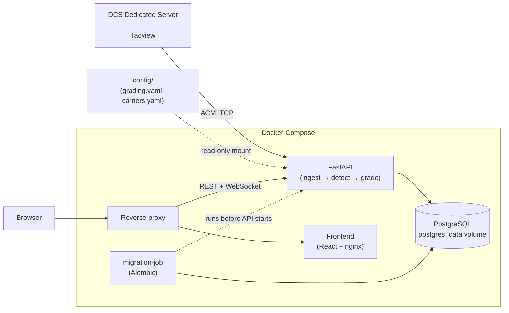

# DCS Landing Teacher

[](https://github.com/MasterMk2/DCSLandingTeacher/actions/workflows/ci.yml)
[](LICENSE)

DCS World Dedicated Server で発生した陸上空港への着陸と空母への着艦を、
Tacview の ACMI データストリームから記録・評価し、ブラウザで振り返るためのツールです。

- Tacview Realtime Telemetry（ACMI 2.2 Text / TCP）の受信・解析（接続先は Tacview の設定に合わせて指定）
- **ACMI ファイルインポート**：過去の Tacview 記録（`.acmi` / `.acmi.txt` / `.acmi.zip`）から着陸記録を一括生成
- 着陸・着艦イベントの自動検出（タッチダウン・ボルター・タッチアンドゴーを識別）
- 米海軍式 LSO グレーディングによる空母着艦の自動評価（`OK` / `OK-` / `(OK)` / `_NO_GRADE_` / `CUT` + ファクター）
- 陸上着陸の簡易評価（グライドスロープ偏差・センターライン偏差・接地降下率・速度 → A〜E 評点）
- Web UI での閲覧
  - 着陸履歴ダッシュボード（プレイヤー / 機体 / 場所 / グレード等でフィルタ）
  - **GCA（PAR）スコープ風ビュー**：最終進入の方位角・仰角軌跡をレーダースコープ風に描画
  - トップダウン軌跡ビュー、時系列チャート（偏差・速度・AOA・降下率）
  - 着陸検出のリアルタイム通知（WebSocket）
  - CSV エクスポート

要件の詳細は [`plans/requirements.md`](./plans/requirements.md)、実装構成は [`docs/architecture.md`](./docs/architecture.md) を参照してください。

## スクリーンショット

<!-- TODO: 公開前に実際のスクリーンショットを差し替えてください -->

| ダッシュボード | GCA スコープ | 時系列チャート |
| :---: | :---: | :---: |
|  |  |  |

## システム構成（概要）



本番環境では、リバースプロキシ配下でフロントエンドと FastAPI を別コンテナとして起動します。
開発・検証環境でも Docker Compose を使用します。

## 本番環境

本番ホストでは、Docker Engine と Docker Compose を利用します。リポジトリルートで `.env` を作成し、少なくとも `DLT_POSTGRES_PASSWORD` には空でない値を設定してください。Tacview を別ホストで動かす場合は、`DLT_TACVIEW_HOST` と `DLT_TACVIEW_PORT` も変更します。

```bash
# 初回のみ: 本番用の設定ファイルを作成して編集する
cp .env.example .env
${EDITOR:-vi} .env

# Compose の設定を検証してから、バックグラウンドでビルド・起動する
docker compose config --quiet
docker compose up --build -d

# 起動状態と API のヘルスチェックを確認する
docker compose ps
curl -fsS http://localhost:8000/api/health
```

> [!NOTE]
> `.env` の `DLT_PORT` を変更した場合は、上の `curl` コマンドとブラウザで開く URL のポート番号も同じ値にしてください。
>
> 起動ログは `docker compose logs -f`、停止は `docker compose down` で確認・実行できます。
>
> `docker compose down` では PostgreSQL の名前付きボリューム `postgres_data` は削除されません。

## 開発環境

### 必須環境

- Docker Desktop
- [uv](https://docs.astral.sh/uv/)
- Node.js 20 以上

### セットアップ

リポジトリルートで、次の順に実行します。

```powershell
# 開発・検証用の依存関係を取得
cd backend
uv sync
cd ..\frontend
npm ci

cd ..
# Compose 用の設定を作成
cp .env.example .env
# DLT_POSTGRES_PASSWORD に空でないパスワードを設定し、Tacview のホスト/ポートを必要に応じて編集
docker compose up --build
```

- `.env.example` をコピーした設定では、ブラウザで `http://localhost:8080` を開くと Web UI が表示されます。`DLT_PORT` を設定しない場合、Compose 側の既定値は `8080` です
- PostgreSQL データは名前付きボリューム `postgres_data` に永続化されます
- `config/grading.yaml` は読み取り専用でマウントされます。評価閾値を編集した後に再評価 API を呼び出すと、変更がすぐに反映されます
- Linux では `host.docker.internal` が `extra_hosts` 設定によりホスト OS を指します（DCS + Tacview が同一ホストで動いている場合の既定値）

## Tacview 側の設定

1. DCS World に Tacview アドオンを導入する
2. Tacview の設定（`Tacview.ini` または DCS 内メニュー）で、**Realtime Telemetry 出力を有効化**する
   - 使用する TCP ポートを確認します。Tacview 側の Real-Time Telemetry TCP Port と本ツールの設定値を一致させてください
   - パスワードを設定している場合は `.env` の `DLT_TACVIEW_PASSWORD` にも同じ値を設定してください
3. 本ツールの `.env` で接続先を設定する

| 変数 | 既定値 | 説明 |
| --- | --- | --- |
| `DLT_TACVIEW_HOST` | `host.docker.internal` | Tacview Realtime Telemetry のホスト |
| `DLT_TACVIEW_PORT` | `42674` | Tacview 側の Real-Time Telemetry TCP Port と一致させる |
| `DLT_TACVIEW_CLIENT_NAME` | `DCSLandingTeacher` | ハンドシェイクで通告するクライアント名 |
| `DLT_TACVIEW_PASSWORD` | （空） | Telemetry 保護時のパスワード |
| `DLT_ACMI_ENABLED` | `true` | `false` で ACMI 受信を停止（API 単体運用向け） |
| `DLT_AUTH_TOKEN` | （空） | 簡易トークン認証の共有トークン。空なら認証なし（既定）。詳細は「簡易トークン認証」の節を参照 |
| `DLT_IMPORT_MAX_UPLOAD_MB` | `200` | ACMI ファイルインポートのアップロードサイズ上限（MB）。詳細は「ACMI ファイルのインポート」の節を参照 |

### データベースマイグレーション

スキーマ管理には、Alembic を使用する `migration-job` を利用しています。

Compose は、PostgreSQL の起動後に `migration-job` を一度実行してから API を起動します。未適用のマイグレーションのみを手動で適用する場合は、リポジトリルートで次を実行します。

```bash
docker compose run --rm migration-job  # 未適用マイグレーションの適用
```

詳細な環境変数一覧は [`.env.example`](.env.example) を参照してください。

Tacview との接続には、指数バックオフによる自動再接続を使用します。

## API 概要

新規クライアントは REST API の `/api/v1` プレフィックスを使用します。OpenAPI スキーマは `http://localhost:<DLT_PORT>/docs` で確認できます。

### 簡易トークン認証

`.env` の `DLT_AUTH_TOKEN` にトークンを設定すると、Web UI と API へのアクセスに共有トークン認証を適用できます。**既定値は空で、認証なし**のまま従来どおり動作します。

- `/api/v1` 配下の REST エンドポイントには、`Authorization: Bearer <token>` または `X-Auth-Token` ヘッダが必要です（未指定は 401、誤りは 403）
- WebSocket（`/api/v1/ws/landings`）はブラウザからヘッダを付与できないため、`?token=<token>` クエリパラメータで認証します。不正なトークンでは接続できません
- `/api/health`（死活監視用）と Web UI は認証対象外です
- トークン比較は定数時間比較（`secrets.compare_digest`）を使用しています
- Web UI は 401 または 403 を受け取るとトークン入力モーダルを表示し、入力されたトークンを localStorage に保存します。ナビバーの「認証設定」から消去・再入力できます

| メソッド | パス | 説明 |
| --- | --- | --- |
| GET | `/api/v1/health` | 死活監視・ACMI 接続状態（`/api/health` も互換用に利用可） |
| GET | `/api/v1/landings` | 着陸履歴一覧（`player` / `airframe` / `venue` / `kind` / `grade` / `outcome` / `date_from` / `date_to` / `limit` / `offset` でフィルタ・ページング） |
| GET | `/api/v1/landings/{id}` | 個別着陸の詳細（グレード、ファクター、進入軌跡サンプル、接地状態） |
| POST | `/api/v1/landings/{id}/regrade` | 保存済み進入データに対し現在の閾値で再評価 |
| POST | `/api/v1/import` | ACMI ファイルのインポート（multipart、バックグラウンド処理。ジョブ ID を即時返却） |
| GET | `/api/v1/imports` | インポートジョブの一覧（新しい順） |
| GET | `/api/v1/imports/{id}` | インポートジョブの進捗・結果サマリ |
| **WebSocket** | `/api/v1/ws/landings` | 着陸検出のリアルタイム通知とインポート完了通知（`ping` 送信で `pong` 応答） |

## ACMI ファイルのインポート（過去の Tacview 記録から着陸記録を生成）

リアルタイム受信を設定していない場合でも、Tacview のローカル記録から過去のフライトの着陸記録を生成できます。

### ユースケース: Tacview のローカル記録フォルダからインポートする

> [!NOTE]
> Tacview はフライトごとに記録を保存します。既定の保存先は `%USERPROFILE%\Documents\Tacview\` 以下です。
>
> 拡張子は `.acmi`（zip 圧縮されている場合があります）または `.acmi.zip` です。
>
> DCS 専用フォルダを設定している場合は、その配下を確認してください。

1. Web UI のダッシュボードで「ACMI ファイルをインポート」ボタンを押し、ファイルをドラッグ＆ドロップ（またはクリックして選択）します
2. アップロードと解析はバックグラウンドで実行されます。
3. 完了するとインポート結果が表示され、検出された着陸はリアルタイム受信と同じく一覧・詳細ビューに反映されます（WebSocket 通知も共通です）

大量のファイルをまとめて処理する場合は API を直接呼び出すことができます。

```bash
curl -X POST \
     -H "X-Auth-Token: <token>" \
     -F "file=@20240101_多発.acmi" \
     http://localhost:<DLT_PORT>/api/v1/import
# => {"id":"<job_id>", ...}
curl -H "X-Auth-Token: <token>" http://localhost:<DLT_PORT>/api/v1/imports/<job_id>
```

> [!NOTE]
> 同じファイルを何度インポートしても、着陸レコードは二重登録されません。
> 各タッチダウンについて、ACMI ヘッダの `ReferenceTime`、`タッチダウン時刻`、`機体オブジェクト ID` の組み合わせを既存レコードと照合します。
> 一致したものはスキップし、インポート結果に報告します。

> [!NOTE]
> - 受け付ける拡張子は `.acmi` / `.acmi.txt` / `.acmi.zip` です。zip 圧縮された `.acmi` も自動判別して展開します。
> - アップロードサイズ上限は既定 200MB（環境変数 `DLT_IMPORT_MAX_UPLOAD_MB` で変更可）。超過したアップロードは HTTP 413 で拒否されます。
> - インポートジョブの一覧はメモリ上で保持されるため、サーバー再起動で消えます（確定した着陸レコード自体は DB に残ります）。
> - 7z コンテナ（`.acmi.7z`）には対応していません。zip に変換してからインポートしてください。

> [!NOTE]
> WebSocket のパスは `/api/v1/ws/landings` です。フロントエンドもこのパスを使用しています。

## 評価方式

### 空母着艦: LSO グレード

米海軍式の LSO グレーディングに基づき、FLOLS を想定したグライドスロープ（ランプ基準で 3.5°）とセンターラインからの偏差を評価します。評価結果として `OK` / `OK-` / `(OK)` / `_NO_GRADE_` / `CUT` を自動で付与します。

さらに、次のファクターを検出し、根拠データとともに記録します。

- `ARCON` / `AOC` / `AOS` / `FAST` / `SLOW` / `HIGH` / `LOW` / `OFFLINE` / `BOLTER`

### 陸上着陸: 簡易評点

陸上着陸では、次の要素をそれぞれ 0〜100 点で採点します。

- グライドスロープ偏差（3°想定）
- センターライン保持
- 接地降下率（fpm）
- 接地速度（ファイナル終盤の保持速度に対する比）

重み付けして合成した結果に **A〜E** を付与します。実際にオーバーヘッドパターンを飛行しており、軌跡からダウンウィンド脚を取得できた場合は、パターンも採点対象に加わります。

**測定できなかった項目は採点しません。** たとえば、記録が短くグライドスロープを測定できない場合や、ヘリコプターで接地速度比に意味がない場合は、素点を持ちません（API では `score: null`）。これらの項目は重みごと合成から除外されます。

詳細画面には、未評価の項目とその理由を表示します。

採点対象となった項目の重みが `min_measured_weight` に届かない着陸、つまり進入がほとんど記録されていない場合には成績を付けません。`grade` / `score` は `null` になります。

### 滑走路ジオメトリと対応マップ

陸上着陸は、DCSServerBot の RestAPI 経由で DCS 自身から取った実際の滑走路（滑走路進入端の位置・コース・長さ）を基準に採点します。`DLT_DCSSB_BASE_URL` が空の場合は接地点から推定したジオメトリにフォールバックします。精度は落ちますが外部サービスは不要です。

マップごとの設定は不要です。Caucasus / Nevada / Syria / Mariana Islands など、どのマップでも動作します。

ACMI にマップ名は入りません（DCS は `Theater` を書き出しません）。そのため着陸座標から「稼働中のどのサーバの theatre か」を判定し、そのマップだけを1 回スイープして `cache/runways-<Theatre>.json` に保存します。判定に使う`/servers` と `/airbases` は bot 内部の状態から返るため、DCS のシミュレーションスレッドを消費しません。

滑走路ジオメトリはそのマップがロードされている間しか取れません。terrain 側の `terrain.cfg.lua.pak.crypt` は暗号化されており、DCSServerBot の `/airbase` はロード中のミッションに対して Lua を実行するためです。

したがって、そのマップを載せた DCS サーバが 1 台でも起動していることがスイープの条件です。過去の録画を import する場合も同じで、そのマップが今どこかで動いていればスイープされ、動いていなければ推定ジオメトリになります。一度スイープすれば以降はキャッシュだけで解決するので、サーバがマップを切り替えても過去の記録は正しい滑走路に当たり続けます。

`DLT_DCSSB_SERVER_NAME` を指定した場合、そのサーバが今実際に動かしている theatre だけがスイープ対象になります（別マップを動かしている間はスイープしません）。

平行滑走路（Nellis の 03L/21R・03R/21L など）は左右の区別を保ったまま扱われ、接地点は滑走路進入端までの距離ではなく延長センターラインからの横ずれで判定されます。

解決できた滑走路は着陸行の空港/空母欄に `Nellis 03L` の様なフォーマットで記録されます。推定ジオメトリで採点された着陸は空欄のままです（どこに降りたか分からないため）。

そのためのエントリーポイントがあります（`DLT_AUTH_TOKEN` 設定時はトークンが必要）。

```bash
# 1) いま何が解決でき、いま何を捕まえられるか
curl -s localhost:8000/api/v1/runways | jq
# => {"theatres":[{"theatre":"Caucasus","runways":42,"airbases":21,"origin":"shipped"}],
#     "running":["Nevada"], "can_sweep":true}

# 2) 動いているうちに捕まえる（空港1つあたり約1.5秒。着陸が発生するのを待つ必要はない）
curl -s -X POST 'localhost:8000/api/v1/runways/sweep?theatre=Nevada' | jq

# 3) ローカルに保存する（以後どのビルドでも DCS サーバ無しで解決できる）
curl -s localhost:8000/api/v1/runways/Nevada > config/runways/runways-Nevada.json
```

`./config/runways/` に置いた JSON は、Compose が `/app/config` へ読み取り専用でマウントします。読み込み順は 書き込み可能キャッシュ → 設定済み seed で、そのサーバで掃引した結果が常に優先されます。

#### ゲーム内フックで捕獲する（正確・推奨）

seed geometry は DCSServerBot 経由ではなく、ゲーム内フックで取っています。

1. [`scripts/dlt-capture-runways.lua`](scripts/dlt-capture-runways.lua) を `<Saved Games>/<DCS>/Scripts/Hooks/` に置いてミッションをロードする
2. ロード完了時に `Logs/dlt-runways.json` へ全空港の滑走路が書き出される
3. `python scripts/dlt_runways_from_dump.py dlt-runways.json` で `config/runways/runways-<Theatre>.json` が作成される（`"exact": true`）

違いは座標変換方法です。

DCS の x/z は横メルカトルの格子なので、外で緯度経度に変換するには子午線収差だけではなく縮尺係数も必要となります。

DCSServerBot の `/airbase` は格子座標しか返さないためこの変換が近似となります。Caucasus では中央子午線（東経33°）から離れた東部の空港ほどしきい値が離れ、最大 18 m ずれることを実測しました。

フックは DCS 自身の `coord.LOtoLL` で変換するので正確な値となります。

そのため `exact` なシードはそのサーバでのライブ掃引より優先されます。

設定済みの seed map: Caucasus / Nevada / MarianaIslands / PersianGulf / SinaiMap / Syria。

DCSServerBot が無い環境でも、この形式の JSON を置くことで動作します。

> [!NOTE]
> DCS の `getRunways()` が返す滑走路名はそのまま信用していません。
>
>平行滑走路の L/R が無い（Nellis は `3` と `21` の2本）、別の滑走路に名前が付いている（Sinai の Ben-Gurion は 08/26 が `21`、12/30 が `8`）といった例が実データにあるため、方位と合わない名前は捨てて方位から付け直し、平行滑走路には位置関係から L/C/R を付与します。

```jsonc
// ./config/runways/runways-Nevada.json（cache/ に置いたものと同一形式）
{
  "version": 2,          // CACHE_VERSION。古い版は無視され再掃引されます
  "theatre": "Nevada",
  "runways": [
    {
      "airbase": "Nellis",
      "name": "03L",
      "threshold_lat": 36.22,     // 進入端の緯度経度
      "threshold_lon": -115.05,
      "elevation_m": 570.0,       // MSL
      "heading_deg": 31.5,        // 真方位（DCS のグリッド方位ではない）
      "length_m": 3064.0,
      "width_m": 45.0
    }
  ]
}
```

### 閾値の調整（./config/grading.yaml）

評価基準はすべて [`./config/grading.yaml`](./config/grading.yaml) に外部化されており、コード変更なしで調整できます。

```yaml
geometry:
  carrier_glideslope_deg: 3.5   # 空母 FLOLS のグライドスロープ
  land_glideslope_deg: 3.0      # 陸上の想定滑走路角度

detection:
  wow_agl_threshold_m: 3.0      # WOW（接地）判定の AGL 閾値
  full_stop_dwell_s: 15.0       # この時間、停止状態が続いたら full-stop

land_grading:
  weights:                      # 各要素の重み（合計 1.0）
    descent_rate: 0.30
    touchdown_speed: 0.20
    glideslope: 0.25
    centerline: 0.25
  min_measured_weight: 0.5      # これ未満しか測れなければ成績を出さない
  unscored_by_class:            # 測るが採点しない項目（機体クラス別）
    helicopter: ["touchdown_speed", "glideslope"]
  letters:
    A: 90                       # 加重合計スコア → レター評点の境界
    B: 78
    ...
```

編集後、該当する着陸に `POST /api/v1/landings/{id}/regrade` を送ると、保存済みの進入データを新しい閾値で再評価できます。

## 開発

開発環境の構築・テスト実行の詳細は [`./docs/development.md`](./docs/development.md) を参照してください。

### バックエンド

```bash
cd backend
uv sync
uv run ruff check .
uv run pytest -q
```

#### フロントエンド

```
cd frontend
npm ci
npm run build
npm test
```

## ライセンス

MIT License。詳細は [LICENSE](./LICENSE) を参照してください。

- 本プロジェクトは Tacview 公式ドキュメントに基づく ACMI 形式の独自実装であり、
  Tacview 本体・SDK を同梱していません
- DCS 関連アセット（テクスチャ・音声等）は一切同梱していません
- 収集されるフライトデータはユーザー自身の所有物です。サーバー管理者の責任で適切に扱ってください
