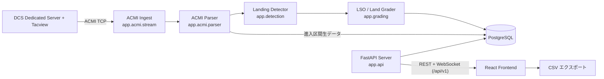

# アーキテクチャ

本ドキュメントは [`plans/requirements.md`](../plans/requirements.md) §6 の構成図をベースに、実際の実装構成を文書化したものです。

## システム全体図



本番（Docker / `docker-compose.yml`）では React フロントエンドと FastAPI をreverse proxy 配下の別コンテナとして起動します。

開発時は Vite dev server が `/api` をバックエンドへプロキシします（`frontend/vite.config.ts`）。フロントエンドは `/api/v1` と `/api/v1/ws/landings` を利用します。

## バックエンド（backend/src/app）

| モジュール | 責務 |
| --- | --- |
| [`acmi/stream.py`](../backend/src/app/acmi/stream.py) | Tacview Realtime Telemetry への TCP 接続。XtraLib ハンドシェイク（`handshake.py`）、自動再接続（指数バックオフ）。ハンドシェイク直後の圧縮ストリーム（gzip / zlib / raw deflate）を先頭バイトから自動判別して透過展開する（Issue #2）。展開失敗時はエラーログを出し、接続断として再接続する |
| [`acmi/parser.py`](../backend/src/app/acmi/parser.py) | ACMI 2.2 Text の行解釈: Time ヘッダ管理、`-`/`+` オブジェクト更新行、イベント行 |
| [`acmi/file_reader.py`](../backend/src/app/acmi/file_reader.py) | 保存済み .acmi / .acmi.zip ファイルの再生（テスト・再評価用） |
| [`ingest.py`](../backend/src/app/ingest.py) | パース結果から機体ごとのサンプルリングバッファを維持し、検出器へ供給 |
| [`importer.py`](../backend/src/app/importer.py) | ACMI ファイルインポート（`POST /api/v1/import`）。アップロードされた記録をリアルタイムと同一の ingest→検出→採点パイプラインでバックグラウンド処理し、ジョブ状態を管理。既存着陸との重複は `ReferenceTime`＋タッチダウン時刻＋機体 ID で判定してスキップ |
| [`api/imports.py`](../backend/src/app/api/imports.py) | インポート REST エンドポイント（認証対象）: `POST /api/v1/import`、`GET /api/v1/imports`、`GET /api/v1/imports/{id}` |
| [`detection/`](../backend/src/app/detection/) | WOW 相当判定・タッチダウン検出、空母/空港の識別、ボルター/タッチアンドゴー/full-stop の分類（`classify.py`）、FLOLS 幾何計算（`geometry.py`） |
| [`grading/lso_grader.py`](../backend/src/app/grading/lso_grader.py) | 空母着艦への米海軍式 LSO グレード＋ファクター付与。BURBLE のみヒューリスティック検出（下記「BURBLE 検出について」） |
| [`grading/land_grader.py`](../backend/src/app/grading/land_grader.py) | 陸上着陸への A〜E 簡易評点 |
| [`grading/config.py`](../backend/src/app/grading/config.py) | `config/grading.yaml` の読み込み（閾値はすべて外部化） |
| [`grading/carriers.py`](../backend/src/app/grading/carriers.py) | `config/carriers.yaml`（艦別 FLOLS ジオメトリ、Issue #3）の読み込みと解決。未知の艦はタッチダウン基準の近似へフォールバック。**収録値は未検証の推定値**であり、実データでの検証が残っている |
| [`pipeline.py`](../backend/src/app/pipeline.py) | 検出 → 採点 → DB 保存 → WebSocket 通知の一連パイプライン。再評価（regrade）も担当 |
| [`models/`](../backend/src/app/models/) | SQLAlchemy（async, psycopg）エンティティ。着陸レコードには進入区間の生サンプルも JSON 保存（FR-7 再評価要件）。スキーマは [`migration-job/`](../migration-job/) の Alembic マイグレーションで管理 |
| [`api/routes.py`](../backend/src/app/api/routes.py) | REST + WebSocket エンドポイント（下記 API セクション） |
| [`api/notifier.py`](../backend/src/app/api/notifier.py) | WebSocket 接続管理・着陸通知のブロードキャスト |
| [`api/main.py`](../backend/src/app/api/main.py) | アプリケーションファクトリ。lifespan で DB 接続・ACMI クライアントを初期化し、CORS と API ルーターを設定 |

### リアルタイム処理フロー

1. `AcmiStreamClient` が Tacview へ接続し、受信行を `TrackIngestor.handle_line` へ渡す
2. パーサが時刻・オブジェクト状態を更新し、ingestor が機体別バッファへ追記する
3. 検出器が接地（WOW）を検出すると、最終進入区間（既定 60 秒 / 2 nm）を切り出す
4. パイプラインが空母/陸地を判定して対応グレーダで採点し、PostgreSQL に保存
5. `LandingNotifier` が接続中の全 WebSocket クライアントへ `{"type": "landing", ...}` を送信。
   タッチダウン直後は outcome 未確定のため `outcome_status: "provisional"` として即時通知し、
   full-stop 滞地時間の経過などで確定した時点で同一レコードを更新する
   `{"type": "landing_update", ...}` を送る二段階方式（Issue #5）

### BURBLE 検出について（Issue #4 / O-3 調査結果）

**ACMI 2.2 仕様上、風情報は取得できない。** ACMI のグローバルプロパティは記録メタデータ（`ReferenceTime` / `RecordingTime` / `Title` / `DataSource` / `DataRecorder` / `Author` / `Comments` / `Category` / `Briefing` / `Debriefing`）のみで、オブジェクトプロパティも運動学と機体状態（`Type` / `Latitude` / `Longitude` / `Altitude` / `Speed` / `Throttle` / `Tailhook` 等）に限られる。

`WindDirection` / `WindSpeed` / 甲板風（WOD）相当のフィールドは存在しないため、風データに基づく BURBLE検出はこのデータソースでは不可能。

そのため [`grading/lso_grader.py`](../backend/src/app/grading/lso_grader.py) では、バーブル特有の**接地直前の沈下率急増**をヒューリスティック検出する:

- 進入終盤の安定基準区間（既定 12 秒）に対し、接地直前 3 秒の派生沈下率平均が閾値（既定 +1.5 m/s）以上増加した場合に minor ファクター BURBLE を付与する。
- 閾値は [`config/grading.yaml`](../config/grading.yaml) の `BURBLE` セクションで調整可能。**閾値は未検証の推定値**であり、実 DCS データでの妥当性確認が完了するまでグレード根拠として絶対視しないこと。

## フロントエンド（frontend/src）

| 領域 | 内容 |
| --- | --- |
| `views/Dashboard.tsx` | 着陸履歴一覧。フィルタ・ページング・リアルタイム追加 |
| `views/Detail.tsx` | 個別着陸の詳細ビュー |
| `components/GcaScope.tsx` | GCA（PAR）スコープ風ビュー（方位角・仰角スコープ）。幾何計算は `lib/gcaGeometry.ts` |
| `components/TopDownTrack.tsx` | トップダウン軌跡ビュー |
| `components/TimeSeriesChart.tsx` | 時系列チャート（recharts） |
| `components/LandingTable.tsx` / `FilterBar.tsx` / `GradeSummary.tsx` | 一覧・フィルタ・グレード集約 |
| `api/client.ts` / `api/ws.ts` | REST クライアントと自動再接続付き WebSocket クライアント |
| `lib/csv.ts` | CSV エクスポート |

## デプロイ構成（Docker）

```text
docker/backend/Dockerfile       # FastAPI API イメージ
docker/frontend/Dockerfile      # React SPA を nginx で配信するイメージ
docker/reverse-proxy/Dockerfile # フロントエンドと API のリバースプロキシ
docker-compose.yml              # reverse proxy、frontend、API、PostgreSQL、migration-job を起動
```

- コンテナ内では `DLT_DATABASE_URL=postgresql+psycopg://…@db:5432/…` を使用し、`postgres_data` ボリュームに永続化する
- `config/grading.yaml` はイメージに焼き込まれるほか、compose 実行時はホスト側を読み取り専用マウントするため、閾値調整が即反映される
- Tacview ホストの既定値は `host.docker.internal`（Linux は `extra_hosts: host-gateway` で解決）
- Windows / Linux ともにパスセパレータ非依存（Python 側は `pathlib`、Dockerfile 内は POSIX パスのみ）

## API エンドポイント

| メソッド | パス | 説明 |
| --- | --- | --- |
| GET | `/api/v1/health` | 死活監視・ACMI 接続状態（**認証対象外**） |
| GET | `/api/v1/landings` | 一覧（フィルタ・ページング） |
| GET | `/api/v1/landings/{id}` | 詳細（ファクター・進入サンプル含む） |
| POST | `/api/v1/landings/{id}/regrade` | 現在の閾値で再評価 |
| POST | `/api/v1/import` | ACMI ファイルインポート（multipart、バックグラウンドジョブ。認証対象） |
| GET | `/api/v1/imports` / `/api/v1/imports/{id}` | インポートジョブの一覧・進捗（認証対象） |
| WebSocket | `/api/v1/ws/landings` | 着陸通知＋インポート完了通知（`ping` → `pong`） |

### 簡易トークン認証（Issue #8）

[`app/api/auth.py`](../backend/src/app/api/auth.py) に共有トークン認証を実装している。

- [`config.py`](../backend/src/app/config.py) の `auth_token`（環境変数 `DLT_AUTH_TOKEN`）が**空の場合は認証無効**で、従来どおり誰でもアクセスできる（デフォルト）
- 設定時、`/api/v1` 配下の REST エンドポイント（landings 系。ルーター `protected_router` に `Depends(require_auth)` で適用）は `Authorization: Bearer <token>` または `X-Auth-Token` ヘッダを要求する。未提示は 401、誤りは 403
- WebSocket はブラウザからヘッダを付けられないため `?token=<token>` クエリパラメータで判定し（`ws_token_ok`）、不一致ならハンドシェイクを拒否する
- `/api/v1/health` と互換 endpoint の `/api/health` は死活監視用に認証対象外
- トークン比較は定数時間比較（`secrets.compare_digest`）
- フロントエンド側は [`auth/token.ts`](../frontend/src/auth/token.ts) でlocalStorage にトークンを保持し、REST クライアントは `X-Auth-Token`、WS クライアントは `?token=` で送付。401/403 検出時は `dlt:auth-invalid` イベント経由でトークン再入力モーダル（[`components/TokenPrompt.tsx`](../frontend/src/components/TokenPrompt.tsx)）を表示する。ナビバーの「認証設定」ボタンで消去・再入力可能

WebSocket の正規パスは **`/api/v1/ws/landings`** であり、フロントエンドもこのパスを使用する。旧 `/api` は互換用の非推奨 alias として並行して提供する。

## 設定

すべて環境変数（プレフィックス `DLT_`、[`backend/src/app/config.py`](../backend/src/app/config.py)）とYAML（[`config/grading.yaml`](../config/grading.yaml)、[`config/carriers.yaml`](../config/carriers.yaml)）で外部化されている。一覧は [`.env.example`](../.env.example) 参照。

`config/carriers.yaml` の艦別 FLOLS ジオメトリ（Issue #3）の数値は**出典不明の推定値・仮置き値**である。実データ（DCS 内での計測等）による検証が完了するまで、グレード結果を絶対評価として扱わないこと。

## CI

`.github/workflows/ci.yml` が push / PR ごとに以下を実行する:

- backend: Python 3.11 で `uv sync --frozen --no-install-project` → `uv run ruff check` → `uv run pytest`
- frontend: Node 20 で `npm ci` → `npm run build`（tsc 含む）→ `vitest run`
- migration-job: Python 3.11 で `uv sync --frozen --no-install-project` → `ruff` → `basedpyright` → `pytest`
- compose: 必須の PostgreSQL 環境変数を与えて `docker compose config --quiet` と `docker compose build`

シークレット不要の公開リポジトリ向け構成。
