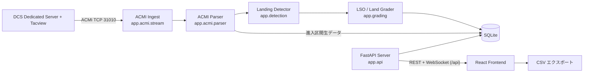

# アーキテクチャ

本ドキュメントは [`plans/requirements.md`](../plans/requirements.md) §6 の構成図をベースに、
実際の実装構成を文書化したものです。

## システム全体図



本番（Docker / `docker-compose.yml`）では React フロントエンドをビルドした成果物
（`frontend/dist`）を FastAPI が静的配信する **1 コンテナ構成**です。
開発時は Vite dev server が `/api` をバックエンドへプロキシします（`frontend/vite.config.ts`）。

## バックエンド（backend/app）

| モジュール | 責務 |
|---|---|
| [`acmi/stream.py`](../backend/app/acmi/stream.py) | Tacview Realtime Telemetry への TCP 接続。XtraLib ハンドシェイク（`handshake.py`）、自動再接続（指数バックオフ）。ハンドシェイク直後の圧縮ストリーム（gzip / zlib / raw deflate）を先頭バイトから自動判別して透過展開する（Issue #2）。展開失敗時はエラーログを出し、接続断として再接続する |
| [`acmi/parser.py`](../backend/app/acmi/parser.py) | ACMI 2.2 Text の行解釈: Time ヘッダ管理、`-`/`+` オブジェクト更新行、イベント行 |
| [`acmi/file_reader.py`](../backend/app/acmi/file_reader.py) | 保存済み .acmi / .acmi.zip ファイルの再生（テスト・再評価用） |
| [`ingest.py`](../backend/app/ingest.py) | パース結果から機体ごとのサンプルリングバッファを維持し、検出器へ供給 |
| [`detection/`](../backend/app/detection/) | WOW 相当判定・タッチダウン検出、空母/空港の識別、ボルター/タッチアンドゴー/full-stop の分類（`classify.py`）、FLOLS 幾何計算（`geometry.py`） |
| [`grading/lso_grader.py`](../backend/app/grading/lso_grader.py) | 空母着艦への米海軍式 LSO グレード＋ファクター付与。BURBLE のみヒューリスティック検出（下記「BURBLE 検出について」） |
| [`grading/land_grader.py`](../backend/app/grading/land_grader.py) | 陸上着陸への A〜E 簡易評点 |
| [`grading/config.py`](../backend/app/grading/config.py) | `config/grading.yaml` の読み込み（閾値はすべて外部化） |
| [`grading/carriers.py`](../backend/app/grading/carriers.py) | `config/carriers.yaml`（艦別 FLOLS ジオメトリ、Issue #3）の読み込みと解決。未知の艦はタッチダウン基準の近似へフォールバック。**収録値は未検証の推定値**であり、実データでの検証が残っている |
| [`pipeline.py`](../backend/app/pipeline.py) | 検出 → 採点 → DB 保存 → WebSocket 通知の一連パイプライン。再評価（regrade）も担当 |
| [`models/`](../backend/app/models/) | SQLAlchemy (async, aiosqlite) エンティティ。着陸レコードには進入区間の生サンプルも JSON 保存（FR-7 再評価要件）。スキーマは Alembic マイグレーションで管理（[`migrations/`](../backend/migrations/)、起動時自動適用） |
| [`api/routes.py`](../backend/app/api/routes.py) | REST + WebSocket エンドポイント（下記 API セクション） |
| [`api/notifier.py`](../backend/app/api/notifier.py) | WebSocket 接続管理・着陸通知のブロードキャスト |
| [`api/main.py`](../backend/app/api/main.py) | アプリケーションファクトリ。lifespan で DB 初期化・ACMI クライアント起動。CORS、SPA 静的配信 |

### リアルタイム処理フロー

1. `AcmiStreamClient` が Tacview へ接続し、受信行を `TrackIngestor.handle_line` へ渡す
2. パーサが時刻・オブジェクト状態を更新し、ingestor が機体別バッファへ追記する
3. 検出器が接地（WOW）を検出すると、最終進入区間（既定 60 秒 / 2 nm）を切り出す
4. パイプラインが空母/陸地を判定して対応グレーダで採点し、SQLite に保存
5. `LandingNotifier` が接続中の全 WebSocket クライアントへ `{"type": "landing", ...}` を送信。
   タッチダウン直後は outcome 未確定のため `outcome_status: "provisional"` として即時通知し、
   full-stop 滞地時間の経過などで確定した時点で同一レコードを更新する
   `{"type": "landing_update", ...}` を送る二段階方式（Issue #5）

### BURBLE 検出について（Issue #4 / O-3 調査結果）

**ACMI 2.2 仕様上、風情報は取得できない。** ACMI のグローバルプロパティは
記録メタデータ（`ReferenceTime` / `RecordingTime` / `Title` / `DataSource` /
`DataRecorder` / `Author` / `Comments` / `Category` / `Briefing` /
`Debriefing`）のみで、オブジェクトプロパティも運動学と機体状態
（`Type` / `Latitude` / `Longitude` / `Altitude` / `Speed` / `Throttle` /
`Tailhook` 等）に限られる。`WindDirection` / `WindSpeed` /
甲板風（WOD）相当のフィールドは存在しないため、風データに基づく BURBLE
検出はこのデータソースでは不可能。

そのため [`grading/lso_grader.py`](../backend/app/grading/lso_grader.py) では、
バーブル特有の**接地直前の沈下率急増**をヒューリスティック検出する:
進入終盤の安定基準区間（既定 12 秒）に対し、接地直前 3 秒の派生沈下率平均が
閾値（既定 +1.5 m/s）以上増加した場合に minor ファクター BURBLE を付与する。
閾値は [`config/grading.yaml`](../config/grading.yaml) の `BURBLE` セクションで
調整可能。**閾値は未検証の推定値**であり、実 DCS データでの妥当性確認が
完了するまでグレード根拠として絶対視しないこと。

## フロントエンド（frontend/src）

| 領域 | 内容 |
|---|---|
| `views/Dashboard.tsx` | 着陸履歴一覧。フィルタ・ページング・リアルタイム追加 |
| `views/Detail.tsx` | 個別着陸の詳細ビュー |
| `components/GcaScope.tsx` | GCA（PAR）スコープ風ビュー（方位角・仰角スコープ）。幾何計算は `lib/gcaGeometry.ts` |
| `components/TopDownTrack.tsx` | トップダウン軌跡ビュー |
| `components/TimeSeriesChart.tsx` | 時系列チャート（recharts） |
| `components/LandingTable.tsx` / `FilterBar.tsx` / `GradeSummary.tsx` | 一覧・フィルタ・グレード集約 |
| `api/client.ts` / `api/ws.ts` | REST クライアントと自動再接続付き WebSocket クライアント |
| `lib/csv.ts` | CSV エクスポート |

## デプロイ構成（Docker）

```
docker/backend.Dockerfile   # Node で frontend/dist をビルド → Python 3.11-slim ランタイムに同梱
docker/frontend.Dockerfile  # （任意）nginx 配信に分離したい場合の代替イメージ
docker-compose.yml          # 単一サービス。SQLite は名前付きボリューム /data に永続化
```

- コンテナ内では `DLT_DATABASE_URL=sqlite+aiosqlite:////data/dlt.db` を使用（ボリューム永続化）
- `config/grading.yaml` はイメージに焼き込まれるほか、compose 実行時はホスト側を
  読み取り専用マウントするため、閾値調整が即反映される
- Tacview ホストの既定値は `host.docker.internal`（Linux は `extra_hosts: host-gateway` で解決）
- Windows / Linux ともにパスセパレータ非依存（Python 側は `pathlib`、Dockerfile 内は POSIX パスのみ）

## API エンドポイント

| メソッド | パス | 説明 |
|---|---|---|
| GET | `/api/health` | 死活監視・ACMI 接続状態 |
| GET | `/api/landings` | 一覧（フィルタ・ページング） |
| GET | `/api/landings/{id}` | 詳細（ファクター・進入サンプル含む） |
| POST | `/api/landings/{id}/regrade` | 現在の閾値で再評価 |
| WebSocket | `/api/ws/landings` | 着陸通知（`ping` → `pong`） |

> WebSocket のパスはルーター共通プレフィックスにより **`/api/ws/landings`** に統一されている。
> フロントエンドもこのパスを使用する。

## 設定

すべて環境変数（プレフィックス `DLT_`、[`backend/app/config.py`](../backend/app/config.py)）と
YAML（[`config/grading.yaml`](../config/grading.yaml)、
[`config/carriers.yaml`](../config/carriers.yaml)）で外部化されている。一覧は [`.env.example`](../.env.example) 参照。

> `config/carriers.yaml` の艦別 FLOLS ジオメトリ（Issue #3）の数値は
> **出典不明の推定値・仮置き値**である。実データ（DCS 内での計測等）による
> 検証が完了するまで、グレード結果を絶対評価として扱わないこと。

## CI

`.github/workflows/ci.yml` が push / PR ごとに以下を実行する:

- backend: Python 3.11 で `pip install -e ".[dev]"` → `ruff check` → `pytest`
- frontend: Node 20 で `npm ci` → `npm run build`（tsc 含む）→ `vitest run`

シークレット不要の公開リポジトリ向け構成。
