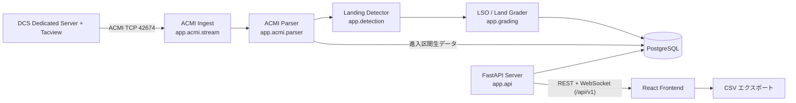

# アーキテクチャ

本ドキュメントは [`plans/requirements.md`](../plans/requirements.md) §6 の構成図をベースに、
実際の実装構成を文書化したものです。

## システム全体図


```mermaid
flowchart LR
    DCS[DCS Dedicated Server + Tacview] -- "ACMI TCP 42674" --> ING[ACMI Ingest<br/>app.acmi.stream]
    ING --> PARSER[ACMI Parser<br/>app.acmi.parser]
    PARSER --> DETECTOR[Landing Detector<br/>app.detection]
    DETECTOR --> GRADER[LSO / Land Grader<br/>app.grading]
    GRADER --> DB[(PostgreSQL)]
    PARSER -- 進入区間生データ --> DB
    API[FastAPI Server<br/>app.api] --> DB
    API -- "REST + WebSocket (/api/v1)" --> UI[React Frontend]
    UI --> SHEET[CSV エクスポート]
```

本番（Docker / `docker-compose.yml`）では reverse-proxy が frontend と API へ転送します。
React の成果物は frontend の nginx が配信し、API は `9001` で待ち受けます。
PostgreSQL と、起動前にスキーマを更新する migration-job は別サービスです。
開発時は Vite dev server が `/api` をバックエンドへプロキシします（`frontend/vite.config.ts`）。

## バックエンド（backend/src/app）

| モジュール | 責務 |
|---|---|
| [`acmi/stream.py`](../backend/src/app/acmi/stream.py) | Tacview Realtime Telemetry への TCP 接続。XtraLib ハンドシェイク（`handshake.py`）、自動再接続（指数バックオフ）。ハンドシェイク直後の圧縮ストリーム（gzip / zlib / raw deflate）を先頭バイトから自動判別して透過展開する（Issue #2）。展開失敗時はエラーログを出し、接続断として再接続する |
| [`acmi/parser.py`](../backend/src/app/acmi/parser.py) | ACMI 2.2 Text の行解釈: Time ヘッダ管理、`-`/`+` オブジェクト更新行、イベント行 |
| [`acmi/file_reader.py`](../backend/src/app/acmi/file_reader.py) | 保存済み .acmi / .acmi.zip ファイルの再生（テスト・再評価用） |
| [`ingest.py`](../backend/src/app/ingest.py) | パース結果から機体ごとのサンプルリングバッファを維持し、検出器へ供給。生の航跡（`tracks`）は着陸の前後だけを書く（下記「生の航跡の保持」） |
| [`retention.py`](../backend/src/app/retention.py) | 生の航跡をどこまで残すかの定義（rebuild が読む範囲と、取り込み・一括縮小が残す範囲）。三者がずれないよう、ここだけで決める |
| [`rescan.py`](../backend/src/app/rescan.py) | DB に残る生の航跡を今の検出器で洗い直し、記録されていない着陸を拾う（`POST /api/v1/flights/{id}/rescan`）。ライブ取り込みと同じ判定で接地を探し、rebuild と同じ切り方で検出し直す |
| [`compact.py`](../backend/src/app/compact.py) | 保持の仕組みより前に記録された DB を、保持窓外の track を PostgreSQL 上で削除する CLI（`python -m app.compact`、アプリ停止中に実行） |
| [`importer.py`](../backend/src/app/importer.py) | ACMI ファイルインポート（`POST /api/import`）。アップロードされた記録をリアルタイムと同一の ingest→検出→採点パイプラインでバックグラウンド処理し、ジョブ状態を管理。既存着陸との重複は `ReferenceTime`＋タッチダウン時刻＋機体 ID で判定してスキップ |
| [`api/imports.py`](../backend/src/app/api/imports.py) | インポート REST エンドポイント（認証対象）: `POST /api/import`、`GET /api/imports`、`GET /api/imports/{id}` |
| [`detection/`](../backend/src/app/detection/) | WOW 相当判定・タッチダウン検出、空母/空港の識別、ボルター/タッチアンドゴー/full-stop の分類（`classify.py`）、FLOLS 幾何計算（`geometry.py`） |
| [`grading/lso_grader.py`](../backend/src/app/grading/lso_grader.py) | 空母着艦への米海軍式 LSO グレード＋ファクター付与。BURBLE のみヒューリスティック検出（下記「BURBLE 検出について」） |
| [`grading/carrier_pattern.py`](../backend/src/app/grading/carrier_pattern.py) | 空母 Case I パターンの読み取り（測定と講評のみ）。着艦区域の座標系を艦自身の座標系（x = 艦首方向、y = 右舷）へ剛体変換し、陸上のパターン解析（`pattern.py`）でブレイク（キスオフ）とダウンウィンドを切り出したうえで、アビーム・90・ウェイク・グルーブ時間・接地時の沈下（フレアの有無）を測る |
| [`grading/land_grader.py`](../backend/src/app/grading/land_grader.py) | 陸上着陸への A〜E 簡易評点 |
| [`grading/pattern.py`](../backend/src/app/grading/pattern.py) | 対地トラックによる進入の区間分割（イニシャル / ブレイク / ダウンウィンド / ベース / ファイナル）と、オーバーヘッドパターン固有のメトリクス（旋回明けの軸ずれ、ダウンウィンド方位・高度、ブレイクの高度変動と **G・バンク角・進入速度・旋回量**）。G 系は測定のみで採点しない |
| [`grading/kinematics.py`](../backend/src/app/grading/kinematics.py) | 進入軌跡（滑走路座標系の位置 ~5 Hz）の局所 2 次フィットから速度・加速度を導き、法線荷重倍数（G）と旋回率を各サンプルに付ける。ACMI に加速度計の値は無いのでここで導く。採点・再採点のたびに計算し直す。実記録の Roll との突き合わせは [`grading-references.md`](grading-references.md) を参照 |
| [`grading/config.py`](../backend/src/app/grading/config.py) | `config/grading.yaml` の読み込み（閾値はすべて外部化） |
| [`grading/carriers.py`](../backend/src/app/grading/carriers.py) | `config/carriers.yaml`（艦別の着艦区域ジオメトリ、Issue #3）の読み込みと解決。米空母の値は MOOSE AIRBOSS から（アングルドデッキは左舷へ 9.14°、グライドスロープの終点は 3 番ワイヤーの 2 m 上）。**このサーバの実トラップでは未検証**（`validated: false`） |
| [`grading/deviations.py`](../backend/src/app/grading/deviations.py) | 進入区間の偏差（残距離・グライドスロープ偏差・横ずれ）。空母は **甲板と一緒に動く座標系**: 各サンプル時刻の艦位置・艦首方位から目標ワイヤーを置き直し、高さは甲板から測る（Tacview の AGL は海面基準なので使わない）。G の導出用に、接地時刻で固定した地面座標（`fixed_along` / `fixed_lateral`）も併せて持つ |
| [`pipeline.py`](../backend/src/app/pipeline.py) | 検出 → 採点 → DB 保存 → WebSocket 通知の一連パイプライン。再評価（regrade）と、生の航跡からの作り直し（rebuild）も担当 |
| [`rebuild.py`](../backend/src/app/rebuild.py) | 保存済みの着陸を DB の生の航跡（`tracks`）から作り直すための読み戻し。機体のサンプル・同じフライトの全空母・地面基準（最寄りの艦か静的オブジェクト）をライブ取り込みと同じ形で組み立て、今の検出器が切り出したイベントのうち保存時刻 ±2 秒のものだけを同じ着陸とみなす |
| [`models/`](../backend/src/app/models/) | SQLAlchemy (async, psycopg / PostgreSQL) エンティティ。着陸の進入区間（FR-7 再評価要件）は別テーブル `landing_tracks` に zlib 圧縮した JSON で持ち、`Landing.approach_track` から列のように読み書きする。`landings` の行の途中に数百 KB の JSON があると、一覧が並べ替え・絞り込みに使う後ろの列を読むたびにそれを読み飛ばすことになるため。着陸行の削除は外部キーの `ON DELETE CASCADE` で進入区間へ連鎖する。スキーマは [`migration-job/migrations/`](../migration-job/migrations/) の Alembic で管理し、API 起動前に別ジョブで適用する |
| [`api/routes.py`](../backend/src/app/api/routes.py) | REST + WebSocket エンドポイント（下記 API セクション） |
| [`api/notifier.py`](../backend/src/app/api/notifier.py) | WebSocket 接続管理・着陸通知のブロードキャスト |
| [`api/main.py`](../backend/src/app/api/main.py) | アプリケーションファクトリ。lifespan で DB 接続・ACMI クライアント起動。CORS と REST/WebSocket を提供 |

### リアルタイム処理フロー

1. `AcmiStreamClient` が Tacview へ接続し、受信行を `TrackIngestor.handle_line` へ渡す
2. パーサが時刻・オブジェクト状態を更新し、ingestor が機体別バッファへ追記する
   （生の航跡は、機体と空母はメモリに直近ぶんを持つだけで、着陸を検出したときにその前後だけ、
   機体とその着陸の艦について書く）
3. 検出器が接地（WOW）を検出すると、進入区間を切り出す（陸上・空母とも既定 300 秒 / 8 nm。
   空母は Case I のブレイク＝キスオフまで入るように。空母のイベントは艦自身の航跡も持つ）
4. パイプラインが空母/陸地を判定して対応グレーダで採点し、PostgreSQL に保存
5. `LandingNotifier` が接続中の全 WebSocket クライアントへ `{"type": "landing", ...}` を送信。
   タッチダウン直後は outcome 未確定のため `outcome_status: "provisional"` として即時通知し、
   full-stop 滞地時間の経過などで確定した時点で同一レコードを更新する
   `{"type": "landing_update", ...}` を送る二段階方式（Issue #5）

### 生の航跡の保持（`tracks`）

検出はメモリ上のバッファだけで動き、`tracks` を読むのは保存済み着陸の作り直し
（rebuild）だけで、読む範囲は接地の 360 秒前〜60 秒後に限られる。それでも以前は
全オブジェクト（ミサイル・砲弾・チャフ・地上車両を含む）の全更新を書いていたため、
本番 DB は `tracks` が 8,778 万行（2026-09-05 計測）、ファイルが約 11 GB になっていた
（1 行あたり約 120 バイトはローカルの実記録での実測値で、この 2 つの数字と合う）。

今は [`retention.py`](../backend/src/app/retention.py) の定義に従い、次だけを書く:

- **機体**: 着陸ごとに「初接地の 420 秒前〜接地の 120 秒後」（rebuild が読む範囲の
  両側に 60 秒の余裕）。直近 600 秒ぶんの生サンプルをメモリに持ち、窓の終わりを
  過ぎた時点、または機体の消滅・セッションの切り替え・終了の時点で書く。窓が
  開いたまま古いサンプルがメモリから落ちる場合（2 分未満の間隔で着艦が続き、
  窓がつながり続ける甲板など）は、落ちる時点で書く
- **空母**: その着陸が降りた艦だけ、同じ窓。検出器が艦を見るのは機体から 800 m
  以内なので、ほかの艦は作り直しの結果を変えない（全艦を残すと、忙しいサーバでは
  艦の航跡がほぼ丸ごと残ってしまう）
- 書き込みに失敗したバッチでも、窓の行は捨てずに次のバッチで書き直す
- **静的オブジェクト**: 受け取ったとおり全部（ほとんど更新されず、rebuild の
  地面基準が読む）
- **それ以外**（ミサイル・砲弾・チャフ・地上車両など）: 書かない

ローカルの実記録（63 万行の ACMI）を流し直した実測では、取り込み時間が
124 秒 → 72 秒、`tracks` が 56 万行 → 7 行（その記録には正しい着陸が無い）になった。
検証用に全部を記録したいときだけ `DLT_KEEP_ALL_TRACKS=true` にする。

この仕組みより前に記録された DB は、一度だけ次の順で縮める（窓の外は戻せない）:

1. `scripts/rescan-landings.py` で全フライトを洗い直す（既定は下見、`--apply` で記録）。
   2026-09-06 以前の空母着艦のように、当時の検出器が見落とした着陸はここでしか拾えない
2. アプリを止めて `python -m app.compact /data/dlt.db` で `dlt.db.compact` を作って検証し、
   `--swap` で差し替える。元のファイルは `dlt.db.pre-compact-<時刻>` として残るので、
   確認後に手で消す

### BURBLE 検出について（Issue #4 / O-3 調査結果）

**ACMI 2.2 仕様上、風情報は取得できない。** ACMI のグローバルプロパティは
記録メタデータ（`ReferenceTime` / `RecordingTime` / `Title` / `DataSource` /
`DataRecorder` / `Author` / `Comments` / `Category` / `Briefing` /
`Debriefing`）のみで、オブジェクトプロパティも運動学と機体状態
（`Type` / `Latitude` / `Longitude` / `Altitude` / `Speed` / `Throttle` /
`Tailhook` 等）に限られる。`WindDirection` / `WindSpeed` /
甲板風（WOD）相当のフィールドは存在しないため、風データに基づく BURBLE
検出はこのデータソースでは不可能。

そのため [`grading/lso_grader.py`](../backend/src/app/grading/lso_grader.py) では、
バーブル特有の**接地直前の沈下率急増**をヒューリスティック検出する:
進入終盤の安定基準区間（既定 12 秒）に対し、接地直前 3 秒の派生沈下率平均が
閾値（既定 +1.5 m/s）以上増加した場合に minor ファクター BURBLE を付与する。
閾値は [`config/grading.yaml`](../config/grading.yaml) の `BURBLE` セクションで
調整可能。**閾値は未検証の推定値**であり、実 DCS データでの妥当性確認が
完了するまでグレード根拠として絶対視しないこと。

## フロントエンド（frontend/src）

| 領域 | 内容 |
|---|---|
| `views/Dashboard.tsx` | 着陸履歴一覧。フィルタ・ページング・リアルタイム追加 |
| `views/Detail.tsx` | 個別着陸の詳細ビュー |
| `components/GcaScope.tsx` | GCA（PAR）スコープ風ビュー（方位角・仰角スコープ）。幾何計算は `lib/gcaGeometry.ts` |
| `components/TopDownTrack.tsx` | トップダウン軌跡ビュー |
| `components/TimeSeriesChart.tsx` | 時系列チャート（recharts）: 偏差・速度・降下率に加え、荷重倍数（G）とバンク角。ブレイク区間の G は別色で重ねる |
| `components/LandingTable.tsx` / `FilterBar.tsx` / `GradeSummary.tsx` | 一覧・フィルタ・グレード集約 |
| `api/client.ts` / `api/ws.ts` | REST クライアントと自動再接続付き WebSocket クライアント |
| `lib/csv.ts` | CSV エクスポート |

## デプロイ構成（Docker）

```
docker/backend/Dockerfile   # Python 3.11 API、src と同梱設定
docker/frontend/Dockerfile  # Node で frontend/dist をビルド → nginx 配信
docker/migration-job/Dockerfile # Alembic と backend metadata
docker/reverse-proxy/       # frontend / API への転送
docker-compose.yml          # reverse-proxy / frontend / api / migration-job / db
```

- PostgreSQL は `postgres_data`、滑走路キャッシュは `runway_cache` の名前付きボリュームに保存する
- `config/grading.yaml` はイメージに焼き込まれるほか、compose 実行時はホスト側を
  読み取り専用マウントするため、閾値調整が即反映される
- Tacview ホストの既定値は `host.docker.internal`（Linux は `extra_hosts: host-gateway` で解決）
- Windows / Linux ともにパスセパレータ非依存（Python 側は `pathlib`、Dockerfile 内は POSIX パスのみ）

## API エンドポイント

| メソッド | パス | 説明 |
|---|---|---|
| GET | `/api/health` | 死活監視・ACMI 接続状態（**認証対象外**） |
| GET | `/api/landings` | 一覧（フィルタ・ページング） |
| GET | `/api/landings/{id}` | 詳細（ファクター・進入サンプル含む） |
| POST | `/api/landings/{id}/regrade` | 現在の閾値で再評価 |
| POST | `/api/landings/{id}/rebuild` | 生の航跡から検出・採点をやり直す（409: `NO_RAW_TRACK` / `NOT_AN_AIRCRAFT` / `REBUILD_NO_MATCH` / `NO_TOUCHDOWN_TIME`、行は変えない） |
| GET | `/api/v1/flights` | 記録済みの ACMI セッション（`flights`）の一覧と着陸数 |
| POST | `/api/v1/flights/{id}/rescan` | そのフライトの生の航跡から、記録されていない着陸を探す。既定は下見、`?apply=true` で採点して記録（通知はしない）。記録済みの着陸には触らない |
| POST | `/api/import` | ACMI ファイルインポート（multipart、バックグラウンドジョブ。認証対象） |
| GET | `/api/imports` / `/api/imports/{id}` | インポートジョブの一覧・進捗（認証対象） |
| WebSocket | `/api/v1/ws/landings` | 着陸通知＋インポート完了通知（`ping` → `pong`） |

### 簡易トークン認証（Issue #8）

[`app/api/auth.py`](../backend/src/app/api/auth.py) に共有トークン認証を実装している。

- [`config.py`](../backend/src/app/config.py) の `auth_token`（環境変数 `DLT_AUTH_TOKEN`）
  が**空の場合は認証無効**で、従来どおり誰でもアクセスできる（デフォルト）
- 設定時、`/api` 配下の REST エンドポイント（landings 系。ルーター
  `protected_router` に `Depends(require_auth)` で適用）は
  `Authorization: Bearer <token>` または `X-Auth-Token` ヘッダを要求する。
  未提示は 401、誤りは 403
- WebSocket はブラウザからヘッダを付けられないため `?token=<token>` クエリ
  パラメータで判定し（`ws_token_ok`）、不一致ならハンドシェイクを拒否する
- `/api/v1/health` と互換 alias `/api/health` は死活監視用に認証対象外。
  フロントエンドの静的配信は別の nginx サービスが担当する
- トークン比較は定数時間比較（`secrets.compare_digest`）
- フロントエンド側は [`auth/token.ts`](../frontend/src/auth/token.ts) で
  localStorage にトークンを保持し、REST クライアントは `X-Auth-Token`、
  WS クライアントは `?token=` で送付。401/403 検出時は
  `dlt:auth-invalid` イベント経由でトークン再入力モーダル
  （[`components/TokenPrompt.tsx`](../frontend/src/components/TokenPrompt.tsx)）
  を表示する。ナビバーの「認証設定」ボタンで消去・再入力可能

> WebSocket のパスはルーター共通プレフィックスにより **`/api/v1/ws/landings`** に統一されている。
> フロントエンドもこのパスを使用する。

## 設定

すべて環境変数（プレフィックス `DLT_`、[`backend/src/app/config.py`](../backend/src/app/config.py)）と
YAML（[`config/grading.yaml`](../config/grading.yaml)、
[`config/carriers.yaml`](../config/carriers.yaml)）で外部化されている。一覧は [`.env.example`](../.env.example) 参照。

> `config/carriers.yaml` の艦別ジオメトリ（Issue #3）は、米空母（ニミッツ級
> スーパーキャリア / Stennis / Forrestal）については 2026-09-26 に MOOSE AIRBOSS の
> 値（甲板高とアングルドデッキ角は DCS 本体のデータファイルを出典とする）へ
> 取り直した。それ以前の値はアングルドデッキが右舷向き（+9°）で、ランプも左舷に
> 置かれていた。いずれも **このサーバの実トラップでは未検証**（`validated: false`）
> なので、検証が済むまでグレード結果を絶対評価として扱わないこと。クズネツォフは
> 出典の無い推定値のまま（向きの符号だけ左舷に揃えた）。

## CI

`.github/workflows/ci.yml` が push / PR ごとに以下を実行する:

- backend: Python 3.11 と PostgreSQL 18、`uv sync --frozen --no-install-project` → `uv run ruff check .` → `uv run pytest -q`
- frontend: Node 20 で `npm ci` → `npm run build`（tsc 含む）→ `vitest run`
- migration-job: PostgreSQL 18 上の upgrade/check/downgrade とデータ移行テスト、Ruff、basedpyright
- compose: 設定検証と全サービスのビルド

シークレット不要の公開リポジトリ向け構成。
