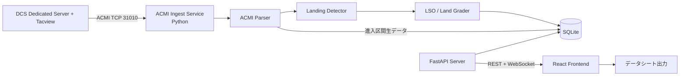

# DCS Landing Teacher — 要件定義書 v0.1

## 1. 目的・背景

DCS World Dedicated Server 上で行われた **着陸（陸上空港）／着艦（空母）** を、
プレイヤーが後から簡便に振り返り、自己改善につなげられるようにする。

- Tacview（導入済み）の ACMI データストリームを情報源とする
- 着陸・着艦の進入コースを視覚的に確認できる
- 米海軍式 LSO グレーディングによる自動評価を行う
- Web ブラウザから閲覧できる

## 2. 確定事項（ユーザー決定）

| 項目 | 決定内容 |
|---|---|
| データ取得 | **リアルタイム ACMI ストリーム受信（TCP 31010 番等）を主方式**。着陸直後に即座に評価結果を Web 表示 |
| 評価方式 | **米海軍式の本格 LSO グレード**（OK / OK- / (OK) / _NO_GRADE_ / CUT 等）＋ファクター（ARCON, AOC, AOS 等）を空母着艦に適用。**陸上着陸は別の簡易評価** |
| 技術スタック | **Python (FastAPI) バックエンド + TypeScript/React フロントエンド** |
| 実行環境 | Windows / Linux / Docker |
| 公開方針 | GitHub で公開可能な構成（ライセンス周りに配慮） |

## 3. システムスコープ

### 3.1 対象（In Scope）

1. Tacview ACMI リアルタイムストリーム（TCP）の受信・解析
2. 着陸／着艦イベントの自動検出（空母・空港の識別を含む）
3. 空母着艦への LSO グレーディング自動評価
4. 陸上着陸への簡易評価（グライドスロープ偏差・センターライン偏差・接地速度・降下率等）
5. Web UI での閲覧
   - 着陸履歴一覧（プレイヤー・機体・空港/空母・日時・グレード）
   - 個別着陸の詳細ビュー
   - **GCA（PAR）スコープ風ビュー**: 最終進入の方位角・仰角軌跡をレーダースコープ風に描画、理想コースとの偏差を表示
   - トップダウン軌跡ビュー（進入コースの平面図）
   - 時系列チャート（高度偏差・水平偏差・AOA・速度・降下率）
6. 評価結果のデータシート出力（GCA スコープ軌跡を含む）
7. Docker Compose によるデプロイ

### 3.2 対象外（Out of Scope）

- DCS 本体・Tacview 本体の配布・インストール管理
- DCS 内蔵アセット（テクスチャ・音声等）の再配布
- リプレイ再生機能（Tacview 本体に任せる）
- 認証付きマルチテナント運用（初版は単一サーバー運用を想定）

## 4. 機能要件

### FR-1: ACMI ストリーム受信

- Tacview Realtime Telemetry（ACMI 2.2 Text、TCP ポート既定 31010）に接続し、常時受信する
- 接続断・再接続に自動対応する
- 受信データは時間管理（Time ヘッダ）・オブジェクト更新（`-`/`+` 行）を正しく解釈する
- 参考: ACMI 形式は Tacview 公式ドキュメント（https://www.tacview.net/documentation/acmi/en/）に基づく実装とする

### FR-2: 着陸／着艦イベント検出

- オブジェクトの `Type` プロパティから航空機・空母・空港（Static object）を識別
- 空母判定: `Type=Carrier+...`（Kuznetsov, Stennis, Forrestal 等の艦種コード）
- 高度変化・速度・WOW（Weight on Wheels 相当の判定）からタッチダウンを検出
- タッチダウン前後の進入区間（最終進入: 約 2nm / 約 3 分間）を自動切り出し
- ボルター（Bolter）・タッチアンドゴーの識別

### FR-3: LSO グレーディング（空母）

- 米海軍式グレードを自動付与: **OK / OK- / (OK) / _NO_GRADE_ / CUT**
- グレードファクターの自動検出（初版対象）:
  - 進入系: ARCON, AOC, AOS, FAST, SLOW, HIGH, LOW, OFFLINE
  - 着艦系: BOLTER, WOW, INTAKE, IMMAT, T&R, NWS, OPEN, POWER
  - 環境系: BURBLE（甲板風の影響。検出は簡易版）
- 評価基準は FLOLS（Fresnel Lens Optical Landing System）想定の
  グライドスロープ（3.5°、ランプ基準）・センターラインからの偏差に基づく
- ファクター定義・閾値は設定ファイル（YAML/JSON）で外部化し、調整可能にする

### FR-4: 陸上着陸の簡易評価

- グライドスロープ（3°想定、設定可能）からの偏差
- センターライン偏差
- 接地時の降下率（fpm）・速度・AOA
- 接地点の分散（過去着陸との比較）
- 総合評点（A〜E 等）とコメント生成

### FR-5: Web UI

- ダッシュボード: 着陸履歴一覧（フィルタ: プレイヤー/機体/空港・空母/期間/グレード）
- 詳細ビュー:
  - **GCA スコープ風ビュー**（方位角スコープ＋仰角スコープ、軌跡を残す、理想コース表示）
  - トップダウン軌跡（地図なしのローカル座標系で描画）
  - 時系列チャート（偏差・速度・AOA・降下率）
  - LSO グレード・ファクター一覧と根拠データ
- リアルタイム通知: 着陸検出時に一覧へ即時反映（WebSocket / SSE）
- 日本語 UI（将来的に i18n 対応）

### FR-6: データシート出力

- 個別着陸の評価を 1 枚のデータシート（HTML→印刷/PDF 想定）として出力
- GCA スコープ軌跡図を含む
- CSV エクスポート（統計分析用）

### FR-7: データ保存

- SQLite（初版。Docker ボリュームで永続化）
- 生の ACMI 進入区間データも保存し、評価ロジック改良後に再評価可能にする

## 5. 非機能要件

| ID | 要件 |
|---|---|
| NFR-1 | Windows / Linux / Docker（docker-compose）で動作 |
| NFR-2 | バックエンド: Python 3.11+ / FastAPI、フロントエンド: TypeScript + React（Vite） |
| NFR-3 | ACMI 受信は常時稼働を前提とし、メモリリークなく長時間動作する |
| NFR-4 | 着陸検出から Web 反映まで数秒程度を目標 |
| NFR-5 | GitHub で公開可能: 秘密情報・ローカルパスを含まない、CI（GitHub Actions）でテスト・Lint |
| NFR-6 | 設定は環境変数 + 設定ファイルで外部化（ポート、DB パス、評価閾値） |

## 6. システム構成（概要）



### コンポーネント構成（想定リポジトリ構造）

```
DCSLandingTeacher/
├── backend/            # Python (FastAPI)
│   ├── app/
│   │   ├── acmi/       # ACMI パーサ・ストリームクライアント
│   │   ├── detection/  # 着陸・着艦イベント検出
│   │   ├── grading/    # LSO グレーダ・陸上グレーダ
│   │   ├── api/        # REST / WebSocket エンドポイント
│   │   └── models/     # DB モデル
│   └── tests/
├── frontend/           # TypeScript + React (Vite)
│   └── src/
│       ├── views/      # Dashboard / Detail / GcaScope
│       └── components/
├── config/             # 評価閾値等の設定ファイル
├── docker/             # Dockerfile / docker-compose.yml
├── docs/               # ドキュメント
└── .github/workflows/  # CI
```

## 7. ライセンス方針

| 対象 | 方針 |
|---|---|
| 本プロジェクトのコード | **MIT License**（シンプルで再利用しやすい。代替案: Apache-2.0） |
| Tacview ACMI 形式 | Tacview 公式ドキュメントに基づく独自実装。Tacview 本体・SDK を同梱しない |
| DCS 関連アセット | 一切同梱しない（機体名・艦名等の文字列参照は最小限に） |
| サードパーティ OSS | 依存関係のライセンス（MIT/BSD/Apache 系を優先）を確認し、NOTICE で管理 |
| ユーザーのフライトデータ | ユーザー自身の所有物。サーバー管理者の責任で扱う旨を README に明記 |

## 8. GitHub 運用方針

- リポジトリ: `DCSLandingTeacher`（公開想定。公開前に機密情報チェックを実施）
- ブランチ戦略: `main`（安定）＋ feature branch → Pull Request
- **Issue 運用**: 要件の改善点・問題点・バグは適宜 Issue として起票する
  - ラベル: `enhancement` / `bug` / `question` / `requirements` / `phase-1` 等
  - 要件定義の未決事項も Issue として起票し、トレース可能にする
- CI: GitHub Actions（Python: pytest + ruff / Frontend: 型チェック + ビルド）
- README: セットアップ手順（Windows/Linux/Docker）、Tacview 側の設定方法を必須記載

## 9. マイルストーン（フェーズ分割）

| フェーズ | 内容 |
|---|---|
| **Phase 1: 基盤** | ACMI ストリーム受信・パーサ、着陸イベント検出、SQLite 保存、REST API 骨格 |
| **Phase 2: 可視化** | ダッシュボード一覧、トップダウン軌跡、時系列チャート、リアルタイム通知 |
| **Phase 3: 評価** | 陸上簡易評価、GCA スコープビュー、データシート出力 |
| **Phase 4: LSO** | 空母 LSO グレーディング（グレード＋ファクター）、評価閾値のチューニング |
| **Phase 5: 公開準備** | Docker 化、CI 整備、ドキュメント、ライセンス最終確認、GitHub 公開 |

## 10. 未決事項・リスク（Issue 起票候補）

| ID | 事項 | 種別 |
|---|---|---|
| O-1 | ACMI の空母 `Type` コード・空港 Static オブジェクトの実データでの検証 | 検証 |
| O-2 | FLOLS グライドスロープの厳密な幾何（艦ごとのランプ位置・甲板高度） | 調査 |
| O-3 | BURBLE 等の環境ファクターの検出精度（風データの ACMI での取得可否） | 調査 |
| O-4 | 認証機能の要否（公開サーバーで運用する場合） | 要件確認 |
| O-5 | 複数同時着艦（トラフィック混在時の進入区間切り分け） | 設計 |
| O-6 | Tacview リアルタイムストリームの遅延・圧縮（.zip ACMI）対応範囲 | 検証 |
| O-7 | データシートのフォーマット（PDF 直接生成か HTML 印刷か） | 要件確認 |
